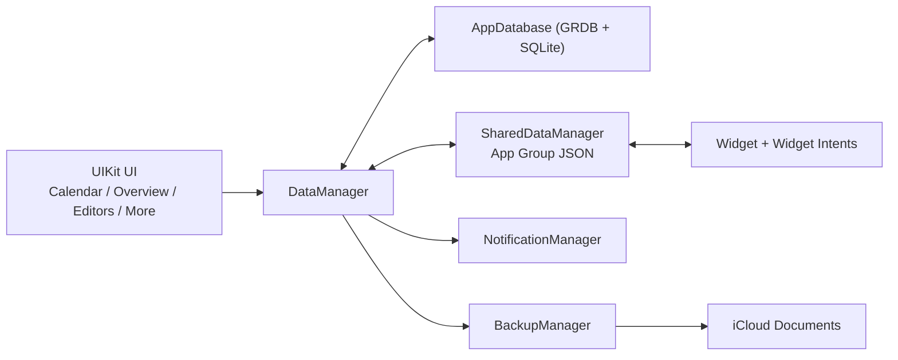

<p align="center">
  
</p>

<h1 align="center">Tag Day</h1>

<p align="center">
  Calendar-first tagging journal for iOS
</p>

<p align="center">
  <a href="https://apps.apple.com/app/id6745145597">
    
  </a>
  
  
  
</p>

Tag Day 是一个以「日历 + 标签 + 记录本」为核心的本地优先（SQLite）记录应用。  
它适用于习惯打卡、生活日志、时间片追踪和按月/按年复盘。

## 目录

- [功能定位](#功能定位)
- [核心能力](#核心能力)
- [功能矩阵](#功能矩阵)
- [架构概览](#架构概览)
- [数据模型](#数据模型)
- [项目结构](#项目结构)
- [开发环境](#开发环境)
- [版本信息](#版本信息)
- [快速开始](#快速开始)
- [App Intents 与 Widget](#app-intents-与-widget)
- [数据与隐私](#数据与隐私)
- [已知限制](#已知限制)
- [路线图](#路线图)
- [贡献指南](#贡献指南)
- [许可证](#许可证)
- [致谢](#致谢)

## 功能定位

从源码结构与业务模型看，本项目属于：

- 本地优先的个人记录工具（非社交、非云协作）
- 日历可视化 + 标签化追踪
- 可按记录本隔离场景（工作/学习/生活等）
- 支持快捷指令、桌面组件、通知、备份的效率应用

## 核心能力

- 日历主视图（Calendar）
  点击某日快速添加记录，支持筛选和月度统计展示
- 快速编辑（Fast Editor）
  在弹窗里直接选 Tag 完成新增/替换
- 记录详情（Record Detail）
  支持开始时间、结束时间、时长、备注
- 标签系统（Tag）
  颜色、标题色、副标题、排序管理
- 记录本系统（Book）
  多记录本切换、归档、图标和颜色自定义
- 概览模式（Overview）
  全年总览，可按日查看多记录本条目
- 批量编辑（Batch Editor）
  按日期选择后批量替换/追加，支持 Tag Circle 模板
- 通知（Notification）
  按记录本配置每日提醒时间与提醒文本
- 备份（Backup）
  支持导出/导入数据库，支持 iCloud 自动备份
- 组件与快捷指令（Widget + App Intents）
  Today Records 小组件 + 多个可编排 Intent

## 功能矩阵

以下能力边界来自当前源码实现：

| 功能 | 免费版 | 会员版（Lifetime） |
| --- | --- | --- |
| 日历记录 / 标签管理 / 记录本管理 | 支持 | 支持 |
| App Intents（新增/查询/打开记录本/备份） | 支持 | 支持 |
| Today Records 小组件（展示） | 支持 | 支持 |
| 小组件交互式加标签面板 | 受限 | 支持 |
| 新增标签数量 | 最多 5 个后受限 | 不限 |
| iCloud 自动备份开关 | 受限 | 支持 |

## 架构概览



## 数据模型

| 模型 | 说明 | 关键字段 |
| --- | --- | --- |
| `Book` | 记录本 | `title`, `symbol`, `color`, `book_type`, `order` |
| `Tag` | 标签 | `book_id`, `title`, `subtitle`, `color`, `title_color`, `order` |
| `DayRecord` | 日记录 | `book_id`, `tag_id`, `day`, `comment`, `start_time`, `end_time`, `duration`, `order` |
| `BookConfig` | 记录本配置 | `book_id`, `notification_time`, `notification_text`, `repeat_weekday` |

## 项目结构

```text
Tag Day/                # 主 App（UIKit）
  Calendar/             # 日历主视图与布局/交互
  DayRecord/            # 记录列表与详情编辑
  Tag/                  # 标签管理与统计
  Book/                 # 记录本管理
  Batch Editor/         # 批量编辑
  Overview/             # 年度概览
  Notification/         # 本地通知配置与调度
  Backup/               # 导入导出与 iCloud 备份
  Database/             # GRDB 数据访问与迁移
  Intent/               # App Intents
  ChineseCalendar/      # 农历/旧历数据与计算
Tag Widget/             # Widget Extension
Tag Day.xcodeproj/      # Xcode 工程
```

## 开发环境

- Xcode 16 或更高版本（推荐）
- iOS Deployment Target: `17.0+`
- Swift: `5.0`
- SPM 依赖（`Package.resolved`）：
  - `GRDB.swift` `7.8.0`
  - `SnapKit` `5.7.1`
  - `ZCCalendar` `0.1.4`
  - `ZipArchive` `2.6.0`
  - `DurationPicker` `1.0.2`
  - `SymbolPicker` `1.6.2`
  - `Toast-Swift` `5.1.1`
  - `AppInfo` `1.3.0`
  - `swift-collections` `1.3.0`

## 版本信息

- App Version（`Tag Day`）：`1.1.1`
- Widget Version（`Tag Widget`）：`1.1.1`
- App Bundle ID：`com.zizicici.tag`
- Widget Bundle ID：`com.zizicici.tag.widget`

## 快速开始

1. 克隆仓库

   ```bash
   git clone <your-repo-url>
   cd Tag-Day
   ```

2. 打开工程

   ```bash
   open "Tag Day.xcodeproj"
   ```

3. 在 Xcode 中选择 Scheme：
   - `Tag Day`（主 App）
   - `Tag Widget`（Widget Extension）

4. 选择 iOS 17+ 模拟器或真机运行

5. 如果你要测试完整能力（Widget / iCloud Backup / Notification）：
   - 配置签名与 Capabilities（App Group、iCloud、Push/Notification）
   - 保持 `group.com.zizicici.tag` 与 `iCloud.com.zizicici.tag` 一致

## App Intents 与 Widget

### App Intents（快捷指令）

当前实现包含以下核心 Intent：

- `AddRecordIntent`：新增记录
- `CheckRecordIntent`：检查某日是否包含指定 Tag
- `CheckTomorrowRecordIntent`：检查明日记录
- `CheckHasRecordsIntent`：检查某日是否有记录
- `CheckRecordTagByTextIntent`：按文本匹配 Tag 检查
- `GetAllRecordsByDateIntent`：获取某日全部记录
- `OpenBookIntent`：打开并切换到目标记录本
- `BackupDatabaseIntent`：触发数据库备份

### Widget（Today Records）

- 尺寸：`systemSmall` / `systemMedium`
- 支持配置记录本、Tag 排序策略、次级日历样式、列数
- 支持深链：`tagday://book/{bookID}`

## 数据与隐私

- 主数据存储于本地 SQLite：
  - `Documents/database/db.sqlite`
- App 与 Widget 通过 App Group 文件共享：
  - `shared_data.json`
- 备份文件支持 `.sqlite` 与 `.zip` 导入导出
- 自动备份写入 iCloud Documents `backup/` 目录
- 源码中未集成第三方统计 SDK；联网能力主要用于 Apple 系统服务（App Store / iCloud / 通知）

## 已知限制

- 当前仓库未包含独立的单元测试 / UI 测试 Target
- 农历/旧历数据源的有效范围主要在 `1900~2099`（次级日历显示相关）
- 部分能力依赖 Apple 开发者账号和真机能力（iCloud、通知等）

## 路线图

- [ ] 增加单元测试和 UI 自动化测试
- [ ] 增加 CI（至少包含构建与静态检查）
- [ ] 补充公开演示截图/GIF
- [ ] 完善开发文档与架构文档

## 贡献指南

欢迎 Issue 和 PR。请先阅读 [`CONTRIBUTING.md`](CONTRIBUTING.md)。

## 许可证

本项目基于 [MIT License](LICENSE) 开源。

## 致谢

感谢以下开源项目：

- [GRDB.swift](https://github.com/groue/GRDB.swift)
- [SnapKit](https://github.com/SnapKit/SnapKit)
- [ZCCalendar](https://github.com/zizicici/ZCCalendar)
- [ZipArchive](https://github.com/ZipArchive/ZipArchive)
- [DurationPicker](https://github.com/mac-gallagher/DurationPicker)
- [SymbolPicker](https://github.com/xnth97/SymbolPicker)
- [Toast-Swift](https://github.com/scalessec/Toast-Swift)
- [AppInfo](https://github.com/zizicici/AppInfo)
- [swift-collections](https://github.com/apple/swift-collections)
